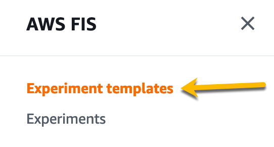

+++
title = "Window CPU Stress Experiment"
date =  2021-07-07T17:25:37-06:00
weight = 30
+++

In this section we will run a CPU Stress test using AWS Fault Injection Simulator against an Amazon Windows EC2 Instance. The Windows CPU stress test will use a custome command document. We will do the following: 

1. Create experiment template to stress CPU.
2. Reset password on Windows Instance
2. Connect to Windows EC2 Instance and run task manager.
3. Start experiment and observe results.

## Create CPU Stress Experiment

First, lets create our stress experiment. We can do this programmaticaly but we will walk through this on the console. 
Open the [AWS Fault Injection Simulator Console](https://console.aws.amazon.com/fis/home?#Home).
Once in the Fault Injection Simulator console, lets click on **Experiment templates** on the left side pane. 


Click on **Create Experiment** on  the upper right hand side of the console to start creating our experiment template. 

Next we will enter the description of the experiment and choose the IAM Role. Let's put **WindowsBurnCPUviaSSM** for the description. The IAM role allows the FIS service permissions to execute the actions on your behalf. As part of the CloudFormation stack a role was created for this experiment that starts with **CpuStress-FISRole**, select that role. Please Examine the CloudFormation template or IAM Role for the policies in this role. 


After we have entered a description and a role, we need to setup our actions. Click the **Add Action** Button in the Actions Section. 

Name the Action, and under Action Type select the **aws:ssm:send-command** action. Currently there is not an out of box Action for Windows CPU Stress Testing, so we are using the send-command action along with a command document that was deployed by our CloudFormation template. To view this document please reference the WinStressDocument resource in the CloudFormation Template.  

Match the rest of the settings as seen in the next screenshot and then click **Save**. This action will use [AWS Systems Manager Run Command](https://docs.aws.amazon.com/systems-manager/latest/userguide/execute-remote-commands.html) to run the CpuStress-WinStressDocument document against our targets for two minutes. To get the document ARN look out that output section of the CloudFormation Stack we deployed for this lab. 


Once we have saved the action, let's edit our targets. Click on **Edit targets**. 
We are going to target our Instances by tag. Match the settings in the next screenshot and click **Save**. 


Once we have actions and targets specified we can click on the **Create Experiment** button toward the bottom of the console. 

For this experiment we did not assign a stop condition, for a workshop or lab this is acceptable. However, it would be considered best practice to have stop conditions on your experiemnts so they dont go out of bounds. Because we do not have a stop condition we are being asked to confirm creation of this experiment. Type in *create* and then hit the **Create Experiment** button again to confirm. 

We have created our Windows CPU stress experiment, now lets connect to our EC2 Instance.

## Use AWS Systems Manager Run Command to rest Password
When we deployed the instance we didnt use SSH Keys, and we dont know the password. However, with the SSM Agent along with the right IAM privileges we have a break glass scenario where we can reset the password. Please use the command below, replacing the **instanceid** with the WindowsCPUStress instance ID and **password** with your password of choice. 

```bash
aws ssm send-command --document-name "AWS-RunPowerShellScript" --document-version "1" --targets '[{"Key":"InstanceIds","Values":["instanceid"]}]' --parameters '{"workingDirectory":[""],"executionTimeout":["3600"],"commands":["net user adminstrator password"]}' --timeout-seconds 600 --max-concurrency "50" --max-errors "0" --cloud-watch-output-config '{"CloudWatchOutputEnabled":false}' --region us-east-1
```

## Use AWS Systems Session Manager to connect to Target Instance

We now need to connect to our EC2 Instance so we can observe the CPU being stressed. We are going to do this be using the port forwarding capability of AWS Systems Manager Session Manager and using RDP.

Run the following command first, this will forward local port 56788 to port 3389 on the Windows EC2 Instance. Replace the **<instanceid>** with the instance ID of the Windows Instance.

```
aws ssm start-session --target <instanceid> --document-name AWS-StartPortForwardingSession --parameters '{"portNumber":["3389"],"localPortNumber":["56788"]}'
```
Once the command says waiting for connections you can launch the RDP client and enter localhost:56788 for the server name and login as administrator with the password you set in the previous section. Once you have RDP'ed into the Windows Instance, launch task manager so you can see the CPU graph as shown below. 


## Run CPU Stress Experiment

Let's head back to the [AWS Fault Injection Simulator Console](https://console.aws.amazon.com/fis/home?#Home).
Once in the Fault Injection Simulator console, lets click on Experiment templates again on the left side pane. 

Select the experiment with the WindowsBurnCPUviaSSM description, then click on the **Actions** button and select **Start Experiment**. 

Now click on the **Start Experiment** button. 

Next type in start and click on **Start Experiment** again to confirm you want to start the experiment. 


This will take you to the experiment, in the detail section of the experiment under state you should see the experiment is initializing. Once the experiment is running, lets go back to the RDP session and observer the task manager graph. 

Watch the CPU percentage, it should hit 100% for a few minutes and then return back to 0%. Once we have observed the action we can logout of the Windows Instance and hit CTRL + C on the window you ran the port forwarding command to close the session. 
 


To clean up this lab, delete the CloudFormation Stack named CPUStress.

Congrats for completing this lab! In this lab you walked through running an experiment that took action within a Windows EC2 Instance using AWS Systems Manager.  Using the integration between Fault Injection Simulator and AWS Systems Manager you can run scripted actions within an EC2 Instance. Through this integration you can script events against your applications or run other choas engineering tools and frameworks. 

